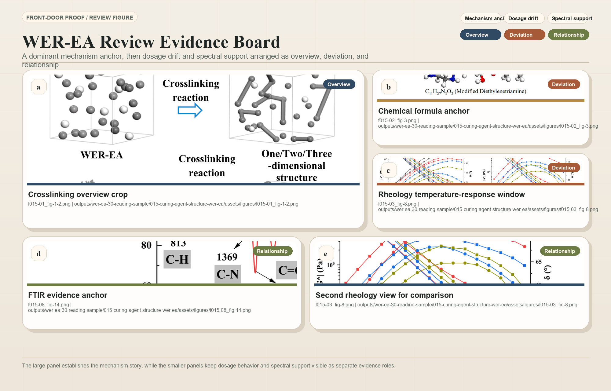

# Materials Science Skills

Materials Science Skills is a full-cycle Codex skill bundle for civil engineering
and construction-materials research. It is built for researchers who need more
than isolated prompts: they need routed workflows, evidence-grounded handoffs,
release-checked skill packaging, and outputs they can use immediately for WER-EA
mini-reviews, experimental manuscripts, figures, reviewer responses, and PPTX
decks.

The bundle is strongest where materials work is usually fragile: source
anchoring, claim boundaries, paper-production routing, and reviewer-risk
control. WER-EA remains the first-class route, but the architecture also covers
asphalt pavement materials, cement/concrete, durability, sustainability, and
broader construction-materials manuscripts.



## Why This Bundle Feels Like A System

- It routes work across research, citation, reader, writing, figure, data,
  polishing, reviewer, response, paper-to-PPT, and real PPTX generation.
- It uses standard intermediate artifacts such as `reader-package`,
  `citation_handoff.csv`, `figure_handoff.csv`, and gate reports so later
  skills do not draft from memory.
- It ships with tests, release checks, plugin packaging, and a mirrored plugin
  skill tree so the installed experience stays aligned with the source repo.

## Four Workflow Entry Points

| Workflow | Start With | Core Handoffs | Final Product |
|---|---|---|---|
| WER-EA mini-review | `materials-research` | citation -> reader -> writing -> figure -> reviewer | Review-ready package with screening, evidence chain, outline, figures, and risk notes |
| Experimental manuscript | `materials-research` | data -> writing -> figure -> polishing -> reviewer | Draft-ready manuscript package with figure/data boundaries |
| Revision loop | `materials-reviewer` or `materials-response` | reviewer -> weakness routing -> writing/polishing/figure/data -> response | Point-by-point response plus routed manuscript fixes |
| Paper to presentation | `materials-paper2ppt` | paper2ppt -> pptx | Chinese slide outline or real `.pptx` deck |

## Quick Start

1. Install the plugin or copy the skills locally. Full instructions live in
   [install.md](install.md).
2. Start broad work with `materials-research` when you need routing,
   paper-stage judgment, or a multi-skill plan.
3. Jump straight to the production skill when the deliverable is already clear,
   such as citation screening, reader packaging, manuscript drafting, figure
   work, response writing, or PPTX generation.
4. Run the release checks before calling the bundle updated or released:

   ```powershell
   python .\scripts\run_release_checks.py --json
   ```

Starter prompts:

- `Help me run a WER-EA mini-review workflow from screening to figure planning.`
- `Audit this experimental manuscript for evidence gaps before I draft the discussion.`
- `Turn this paper package into a journal-club slide outline and then a real PPTX.`

## Guided Demos

- [WER-EA mini-review](docs/workflows/wer-ea-mini-review.md):
  screening -> reader package -> review outline -> figure planning
- [Experimental manuscript](docs/workflows/experimental-manuscript.md):
  manuscript audit -> data/figure tightening -> bounded discussion
- [Revision loop](docs/workflows/revision-loop.md):
  reviewer comments -> weakness routing -> proof-backed response package
- [Paper to presentation](docs/workflows/paper-to-presentation.md):
  slide-ready Markdown -> real `.pptx`

If you want the index first, open [docs/workflows/README.md](docs/workflows/README.md).

## Installation Paths

- Codex plugin:
  `codex plugin marketplace add https://github.com/cooleava1-gif/materials-skills.git --ref main`
  then `codex plugin add materials-skills@materials-skills`
- Manual skills install:
  run `.\scripts\install.ps1` from the repository root
- Installed-state verification:
  rerun `.\scripts\install.ps1` after skill changes, then compare source,
  plugin mirror, and installed skill behavior through
  `.\scripts\run_release_checks.py --json`

## Skill Status Index

For fuller human-readable routing notes, see [docs/skills-index.md](docs/skills-index.md).

| Module | Maturity | Scripts | Tests | Typical input | Typical product |
|---|---|---|---|---|---|
| `materials-research` | Stable paper-production router | Yes | Yes | Research idea, journal target, manuscript task | Route, topic angle, workflow package, gate/risk map |
| `materials-reader` | Stable production skill | Yes | Yes | PDF/text, paper notes, figure caption | Reader package, evidence-chain matrix, citation/figure handoff |
| `materials-citation` | Stable MCP-backed skill | Yes | Yes | Topic, claim list, candidate sources | Search plan, screened citation matrix, normalized IDs, reference gaps |
| `materials-writing` | Stable production skill | Yes | Yes | Claims, results, outline, Chinese draft | Manuscript section, review outline, argument chain |
| `materials-polishing` | Stable production skill | Yes | Yes | English draft, Chinese academic paragraph | Polished text, claim-strength audit |
| `materials-response` | Stable production skill | Yes | Yes | Reviewer comments, revision notes | Point-by-point response, rebuttal package |
| `materials-reviewer` | Stable audit skill | Yes | Yes | Manuscript draft, abstract, figures | Simulated review, desk-reject risk report |
| `materials-paper2ppt` | Stable handoff skill | Yes | Yes | Paper notes, review matrix, outline | Slide-ready Markdown, talk structure |
| `materials-pptx` | Stable generation skill | Yes | Yes | PPTX-ready Markdown or JSON | Real `.pptx` deck |
| `materials-figure` | Stable production skill | Yes | Yes | Data table, reader/citation handoff, figure idea | Figure plan, WER-EA atlas output, caption boundary, figure package |
| `materials-data` | Stable FAIR skill | Yes | Yes | Raw/processed data, metadata needs | FAIR package, data availability statement |

## What You Can Open Immediately

- Human-readable skill guide:
  [docs/skills-index.md](docs/skills-index.md)
- Guided workflow demos:
  [docs/workflows/README.md](docs/workflows/README.md)
- Visual gallery:
  [docs/gallery/README.md](docs/gallery/README.md)
- Paper-production system PRD:
  [docs/superpowers/specs/2026-06-09-materials-paper-production-prd.md](docs/superpowers/specs/2026-06-09-materials-paper-production-prd.md)
- WER-EA sample output package:
  [outputs/wer-ea-30-reading-sample/README.md](outputs/wer-ea-30-reading-sample/README.md)
- Editorial proof boards:
  `skills/materials-figure/assets/showcase-proof/`
- Board manifest:
  `skills/materials-figure/assets/showcase-proof/showcase_manifest.json`
- Figure atlas templates:
  `skills/materials-figure/assets/wer-ea-atlas/generated/`
- Per-skill README files:
  `skills/materials-*/README.md`

## Visual Gallery

If you want to see the system before reading every skill:

- [Materials Science Gallery](docs/gallery/README.md) collects editorial multi-panel
  boards built from reader-package outputs and extracted paper figures.
- The front-door boards follow an `overview -> deviation -> relationship`
  narrative so the gallery reads like a product surface instead of a pile of
  screenshots.
- The gallery links back to the four guided demos so the visuals and the route
  logic stay connected.

## Outcome Showcases

If the deliverable is already clear and you want to jump straight into a result
shape:

- [Submission package](docs/showcases/submission-package.md)
- [Reviewer response](docs/showcases/reviewer-response.md)
- [FAIR data package](docs/showcases/fair-data-package.md)

The hub page is [docs/showcases/README.md](docs/showcases/README.md).

## Product Proof

- The research router already supports `task`, `domain`, `journal`,
  `paper_stage`, `workflow_mode`, and `output_package` routing for
  paper-production workflows.
- The reader and citation path already produces structured handoff artifacts
  instead of loose summaries.
- The figure skill already ships real editorial proof boards, a board manifest,
  WER-EA atlas templates, figure package QA, and export expectations for
  SVG/PDF/PNG/TIFF bundles.
- Release checks already validate architecture, mirror identity, examples,
  scripts, tests, and paper-production surfaces.

## Architecture And Verification

- Architecture contract:
  [docs/architecture/skill-architecture.md](docs/architecture/skill-architecture.md)
- Release-gate contract:
  [docs/architecture/release-gate-contract.md](docs/architecture/release-gate-contract.md)
- Main verification command:

  ```powershell
  python .\scripts\run_release_checks.py --json
  ```

- Local installer:

  ```powershell
  .\scripts\install.ps1
  ```

## Scope

This bundle helps structure materials research work with stronger
evidence, routing, and packaging discipline. It does not replace deep reading,
real experimental evidence, supervisor or co-author judgment, official journal
instructions, or institutional requirements.
