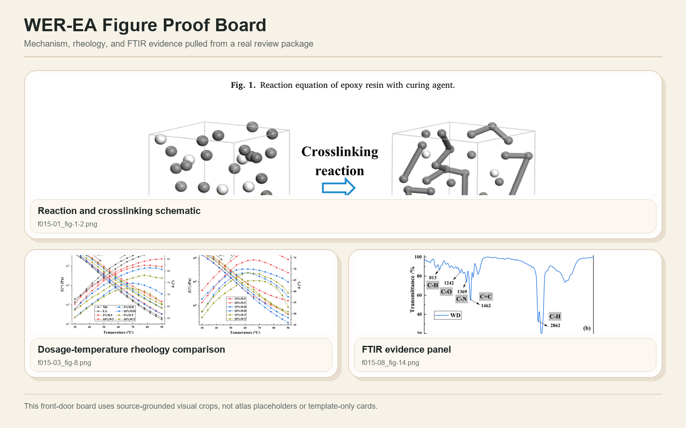

# civil-materials-skills

> 土木工程与建筑材料研究的全流程 AI 技能包 — 基于 nature-skills 架构设计

[](https://star-history.com/#cooleava1-gif/civil-materials-skills&Date)

**civil-materials-skills** 是一个面向土木工程与建筑材料研究的全流程技能包，专为需要结构化工作流、证据锚定交接、发布级技能封装的研究者设计。它覆盖 WER-EA 综述、实验论文、图表制作、审稿回复、PPT 生成等完整研究周期。



## Why This Bundle Feels Like A System

- **路由驱动**：跨研究、引用、阅读、写作、图表、数据、润色、审稿、回复、PPT 等多个技能进行智能路由
- **证据锚定**：使用标准化中间产物（`reader-package`、`citation_handoff.csv`、`figure_handoff.csv`）确保后续技能不从记忆中草拟
- **发布级质量**：自带测试、发布检查、插件封装和镜像技能树，确保安装体验与源仓库一致

## Four Workflow Entry Points

| Workflow | Start With | Core Handoffs | Final Product |
|---|---|---|---|
| **WER-EA 综述** | `civil-materials-research` | citation → reader → writing → figure → reviewer | 综述就绪包（筛选、证据链、大纲、图表、风险说明） |
| **实验论文** | `civil-materials-research` | data → writing → figure → polishing → reviewer | 草稿就绪论文包（含图表/数据边界） |
| **修回循环** | `civil-materials-reviewer` 或 `civil-materials-response` | reviewer → weakness routing → writing/polishing/figure/data → response | 逐条回复 + 路由修复 |
| **论文→PPT** | `civil-materials-paper2ppt` | paper2ppt → pptx | 中文幻灯片大纲或实际 `.pptx` 文件 |

## Quick Start

1. Install the plugin or copy the skills locally. Full instructions live in
   [install.md](install.md).
2. Start broad work with `civil-materials-research` when you need routing,
   paper-stage judgment, or a multi-skill plan.
3. Jump straight to the production skill when the deliverable is already clear,
   such as citation screening, reader packaging, manuscript drafting, figure
   work, response writing, or PPTX generation.
4. Run the release checks before calling the bundle updated or released:

   ```bash
   python scripts/run_release_checks.py --json
   ```

**Starter prompts:**

- `Help me run a WER-EA mini-review workflow from screening to figure planning.`
- `Audit this experimental manuscript for evidence gaps before I draft the discussion.`
- `Turn this paper package into a journal-club slide outline and then a real PPTX.`

**中文快速体验：**

- `帮我运行一个从筛选到图表规划的 WER-EA 综述工作流。`
- `在撰写讨论部分之前，审计这篇实验论文的证据缺口。`
- `把这个论文包变成组会幻灯片大纲，然后生成实际的 PPTX。`

## Installation Paths

### Codex Plugin

```bash
codex plugin marketplace add https://github.com/cooleava1-gif/civil-materials-skills.git --ref main
codex plugin add civil-materials-skills@civil-materials-skills
```

### Claude Code Plugin

```bash
claude plugin marketplace add cooleava1-gif/civil-materials-skills
claude plugin install civil-materials-skills@civil-materials-skills
```

### Manual Install

```bash
git clone https://github.com/cooleava1-gif/civil-materials-skills.git
cd civil-materials-skills
```

**Install one skill:**
```bash
mkdir -p ~/.codex/skills
cp -R skills/_shared ~/.codex/skills/
cp -R skills/civil-materials-reader ~/.codex/skills/
```

**Install all skills:**
```bash
mkdir -p ~/.codex/skills
cp -R skills/_shared ~/.codex/skills/
for d in skills/civil-materials-*; do
  cp -R "$d" ~/.codex/skills/
done
```

**Windows (PowerShell):**
```powershell
.\scripts\install.ps1
```

**Installed-state verification:**
```bash
python scripts/run_release_checks.py --json
```

## Skill Status Index

For fuller human-readable routing notes, see [docs/skills-index.md](docs/skills-index.md).

| Module | Maturity | Scripts | Tests | Typical input | Typical product |
|---|---|---|---|---|---|
| `civil-materials-research` | Stable paper-production router | Yes | Yes | Research idea, journal target, manuscript task | Route, topic angle, workflow package, gate/risk map |
| `civil-materials-reader` | Stable production skill | Yes | Yes | PDF/text, paper notes, figure caption | Reader package, evidence-chain matrix, citation/figure handoff |
| `civil-materials-citation` | Stable MCP-backed skill | Yes | Yes | Topic, claim list, candidate sources | Search plan, screened citation matrix, normalized IDs, reference gaps |
| `civil-materials-writing` | Stable production skill | Yes | Yes | Claims, results, outline, Chinese draft | Manuscript section, review outline, argument chain |
| `civil-materials-polishing` | Stable production skill | Yes | Yes | English draft, Chinese academic paragraph | Polished text, claim-strength audit |
| `civil-materials-response` | Stable production skill | Yes | Yes | Reviewer comments, revision notes | Point-by-point response, rebuttal package |
| `civil-materials-reviewer` | Stable audit skill | Yes | Yes | Manuscript draft, abstract, figures | Simulated review, desk-reject risk report |
| `civil-materials-paper2ppt` | Stable handoff skill | Yes | Yes | Paper notes, review matrix, outline | Slide-ready Markdown, talk structure |
| `civil-materials-pptx` | Stable generation skill | Yes | Yes | PPTX-ready Markdown or JSON | Real `.pptx` deck |
| `civil-materials-figure` | Stable production skill | Yes | Yes | Data table, reader/citation handoff, figure idea | Figure plan, WER-EA atlas output, caption boundary, figure package |
| `civil-materials-data` | Stable FAIR skill | Yes | Yes | Raw/processed data, metadata needs | FAIR package, data availability statement |

## Guided Demos

- [WER-EA mini-review](docs/workflows/wer-ea-mini-review.md)：筛选 → 阅读包 → 综述大纲 → 图表规划
- [Experimental manuscript](docs/workflows/experimental-manuscript.md)：论文审计 → 数据/图表紧缩 → 有界讨论
- [Revision loop](docs/workflows/revision-loop.md)：审稿意见 → 弱点路由 → 证据支撑回复包
- [Paper to presentation](docs/workflows/paper-to-presentation.md)：幻灯片就绪 Markdown → 实际 `.pptx`

If you want the index first, open [docs/workflows/README.md](docs/workflows/README.md).

## Visual Gallery

- [Civil Materials Gallery](docs/gallery/README.md) — 基于阅读包输出和提取论文图件的编辑级多面板图库
- The front-door boards follow an `overview → deviation → relationship` narrative
- The gallery links back to the four guided demos so the visuals and the route logic stay connected

## Outcome Showcases

If the deliverable is already clear and you want to jump straight into a result shape:

- [Submission package](docs/showcases/submission-package.md)
- [Reviewer response](docs/showcases/reviewer-response.md)
- [FAIR data package](docs/showcases/fair-data-package.md)

The hub page is [docs/showcases/README.md](docs/showcases/README.md).

## Architecture And Verification

- Architecture contract: [docs/architecture/skill-architecture.md](docs/architecture/skill-architecture.md)
- Release-gate contract: [docs/architecture/release-gate-contract.md](docs/architecture/release-gate-contract.md)
- Main verification command: `python scripts/run_release_checks.py --json`

## Contributing

Welcome contributions! See [CONTRIBUTING.md](CONTRIBUTING.md) for:
- Skill directory structure requirements
- SKILL.md format specification
- manifest.yaml writing guide
- Testing requirements
- PR submission process

## Star History

[](https://star-history.com/#cooleava1-gif/civil-materials-skills&Date)

## License

MIT License

## Scope

本技能包帮助结构化土木材料研究工作，提供更强的证据、路由和封装规范。它不能替代深度阅读、真实实验证据、导师或共同作者判断、官方期刊要求或机构要求。
