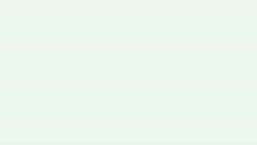

# Civil Materials Gallery

This gallery is the visual proof layer for the bundle. It uses real generated
assets and real sample-package outputs so the product surface shows what the
system already does, instead of what it merely claims to do.

## Screenshot Gallery

### WER-EA mechanism map

### WER-EA evidence heatmap

### WER-EA dosage window

### Reader-package contact sheet

## Workflow Proof

- [WER-EA mini-review demo](../workflows/wer-ea-mini-review.md):
  routing, screening, reader-package extraction, writing, and figure planning
- [Experimental manuscript demo](../workflows/experimental-manuscript.md):
  audit-first route for data, figures, writing, and reviewer risk
- [Revision loop demo](../workflows/revision-loop.md):
  weakness routing plus proof-backed response building
- [Paper to presentation demo](../workflows/paper-to-presentation.md):
  outline-first slide production with PPTX handoff

## Outcome Showcases

- [Submission package](../showcases/submission-package.md):
  templates, gate report, and journal-fit proof before final submission
- [Reviewer response](../showcases/reviewer-response.md):
  point-by-point reply patterns tied to actual manuscript changes
- [FAIR data package](../showcases/fair-data-package.md):
  metadata, availability statement, and dataset-organization proof

## Artifact Deep Dives

- Reader-package sample:
  [outputs/wer-ea-30-reading-sample/README.md](../../outputs/wer-ea-30-reading-sample/README.md)
- Example library:
  [library-index.md](../../skills/civil-materials-research/examples/library/library-index.md)
- Skills index:
  [docs/skills-index.md](../skills-index.md)
- Outcome showcase hub:
  [docs/showcases/README.md](../showcases/README.md)
- Figure atlas output folder:
  `skills/civil-materials-figure/assets/wer-ea-atlas/generated/`

## How To Read This Gallery

- The atlas images show visual structure and certainty encoding.
- The contact-sheet screenshot shows that reader-package outputs can preserve
  figure context and asset lineage.
- The workflow links show where each visual surface fits inside the production
  loop.
- Nothing here should be treated as publishable evidence without checking the
  underlying sources and boundaries.
